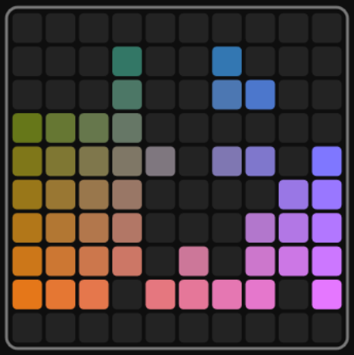

# Blockish

[](https://czechmate777.github.io/blockish/)

A 1010!-style block puzzle game: drag shapes onto a 10×10 grid, clear full rows and columns for points, and try to stay alive as long as you can.

**Play:** [https://czechmate777.github.io/blockish/](https://czechmate777.github.io/blockish/)

## Run locally

Serve the project with any static server, then open `index.html`:

```bash
python3 -m http.server 8080
# Open http://localhost:8080
```

## Tests

Open `test.html` in the browser (e.g. `http://localhost:8080/test.html`) to run the in-browser test suite.

For headless runs (requires Node and Playwright):

```bash
npm install && npx playwright install chromium && npm test
```
